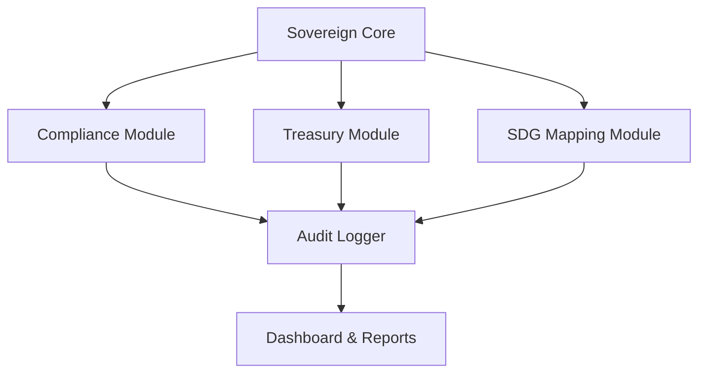

# **Sovereign Blockchain Infrastructure for TEOS Egypt**

Compliance-first, audit-ready, aligned with UN SDGs and Egypt’s Vision 2030.

---

## 🟢 Live Badge Dashboard

| Badge                   | Status                                                                                                                           |
| ----------------------- | -------------------------------------------------------------------------------------------------------------------------------- |
| **CI/CD**               |                           |
| **License**             |                                 |
| **Audit Status**        |                                                           |
| **Coverage**            |                                                                     |
| **Open Issues**         |                                        |
| **Presale Portal**      | [](https://teospump-presale.vercel.app) |
| **Holder Verification** | [](https://solscan.io/)                   |
| **Pi Network Map**      | [](https://emapofpi6390.pinet.com)                            |
| **Bank Portal**         | [](https://bank.teosegypt.com)                                        |
| **NFT Platform**        | [](https://teosnft9637.pinet.com)                                   |
| **Smart City Portal**   | [](https://teospismartcitye8281.pinet.com)                 |
| **Mining Demo**         | [](https://elmahrosamininga1462.pinet.com)                         |
| **GitHub Org**          | [](https://github.com/Elmahrosa)                               |

---

## ⚖️ License

* **Legal:** PolyForm Noncommercial 1.0.0
* **Sovereign Policy:** TEOS Egypt Sovereign License (TESL)

⚠️ Commercial/government use requires written permission from **Ayman Seif / Elmahrosa International**.

---

## 📌 Table of Contents

1. [Overview](#-overview)
2. [Repository Structure](#-repository-structure)
3. [Features](#-features)
4. [Tech Stack](#-tech-stack)
5. [Getting Started](#-getting-started)
6. [Architecture](#-architecture)
7. [Ecosystem & PI Demo Links](#-ecosystem--pi-demo-links)
8. [Contributing](#-contributing)
9. [Security Policy](#-security-policy)
10. [License](#-license)
11. [Contact & Founder](#-contact--founder)

---

## 🏛 Overview

El-Mahrosa.Teos-Sovereign-System is the **sovereign backbone of TEOS Egypt**, enforcing governance, compliance, and civic-first infrastructure.
It provides modules for treasury, SDG mapping, and compliance automation, with **audit transparency** baked in.

---

## 📁 Repository Structure

```text
El-Mahrosa.Teos-Sovereign-System/
├─ README.md                    # Investor-facing overview with live demos
├─ README.DEV.md                # Developer quickstart and docs
├─ LICENSE                      # Dual-license: PolyForm NC + TESL
├─ CODE_OF_CONDUCT.md           # Civic-aligned code of conduct
├─ CONTRIBUTING.md              # Verified contributor guidelines
├─ SECURITY.md                  # Vulnerability disclosure
├─ .gitignore                   # Hygiene & secrets
├─ .env                         # Local environment (ignored)
├─ package.json                 # Node manifest
├─ config/
│  ├─ example.settings.yml      # Copyable example config
│  └─ settings.yml              # Operational config (gitignored)
├─ src/
│  ├─ sovereignCore.js          # Entry point with module mounting
│  ├─ modules/
│  │  ├─ compliance.js          # Compliance middleware
│  │  ├─ treasury.js            # Treasury endpoints
│  │  └─ sdgMapping.js          # SDG registry utilities
│  └─ utils/
│     └─ auditLogger.js         # File-based audit logging
├─ logs/
│  └─ audit.log                 # Generated runtime log
├─ tests/
│  ├─ compliance.test.js
│  ├─ treasury.test.js
│  └─ sdg.test.js
├─ docs/
│  ├─ architecture.md
│  └─ whitepaper.md
└─ .github/
   └─ workflows/
      └─ ci.yml
```

---

## ✨ Features

* **Compliance enforcement:** DCO, immutable releases, governance labeling
* **SDG alignment:** Map modules to UN SDGs for civic transparency
* **Treasury module:** Non-custodial staking and reserves management
* **Audit layer:** Logs, dashboards, verification workflows
* **Modular:** Easily extensible for civic, banking, and NFT components

---

## ⚙ Tech Stack

* **Backend:** Node.js (Express) or Rust/Solana for smart contracts
* **APIs:** GitHub REST + GraphQL integration
* **Automation:** GitHub App webhooks & CI/CD
* **Testing:** Jest/Mocha for Node; Anchor tests for Solana contracts

---

## 🚀 Getting Started

1. **Clone the repo**

```bash
git clone https://github.com/Elmahrosa/El-Mahrosa.Teos-Sovereign-System.git
cd El-Mahrosa.Teos-Sovereign-System
```

2. **Copy config**

```bash
cp config/example.settings.yml config/settings.yml
```

3. **Install dependencies**

```bash
npm install
```

4. **Run tests**

```bash
npm test
```

5. **Start (Node)**

```bash
node src/sovereignCore.js
```

---

## 📊 Architecture



---

## 🔗 Ecosystem & PI Demo Links

All links dynamically integrated for live investor demo access:

| Component               | Type            | Access / Demo                                                      |
| ----------------------- | --------------- | ------------------------------------------------------------------ |
| Developer Docs          | Repo            | [README.DEV.md](README.DEV.md)                                     |
| Presale Portal          | Web App         | [teospump-presale.vercel.app](https://teospump-presale.vercel.app) |
| Holder Verification     | Integration     | [Solscan snapshot](https://solscan.io/)                            |
| Founder Treasury Wallet | Wallet          | `Akvm3CbDN448fyD8qmQjowgBGpcYZtjuKFL4xT8PZhbF`                     |
| Pi Network Map          | Interactive Map | [Map of Pi](https://emapofpi6390.pinet.com)                        |
| Core Repos              | GitHub          | [Elmahrosa Org](https://github.com/Elmahrosa)                      |
| NFT Platform            | dApp            | [TEOS NFT](https://teosnft9637.pinet.com)                          |
| Bank Portal             | dApp            | [TEOS BankChain](https://bank.teosegypt.com)                       |
| Smart City              | Portal          | [Smart City App](https://teospismartcitye8281.pinet.com)           |
| Mining Demo             | Portal          | [Mining Demo](https://elmahrosamininga1462.pinet.com)              |

---

## 🤝 Contributing

Please read [CONTRIBUTING.md](CONTRIBUTING.md) for verified contributor policy, code quality requirements, and licensing terms.

---

## 🛡 Security Policy

Report issues privately as described in [SECURITY.md](SECURITY.md). Do not open public issues for vulnerabilities.

---

## 📜 License

Dual-license governance:

* **PolyForm Noncommercial 1.0.0** — civic & research use
* **TESL (TEOS Egypt Sovereign License)** — commercial rights reserved for the Founder

⚠️ Written permission required from **Ayman Seif / Elmahrosa International** for commercial or government use.

---

## 👤 Contact & Founder

* **Founder:** Ayman Seif
* **Email:** [ayman@teosegypt.com](mailto:ayman@teosegypt.com)
* **LinkedIn:** [linkedin.com/in/aymanseif](https://www.linkedin.com/in/aymanseif)
* **Phone:** `+20 100 616 7293`

---

